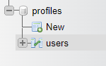
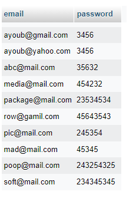
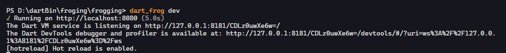
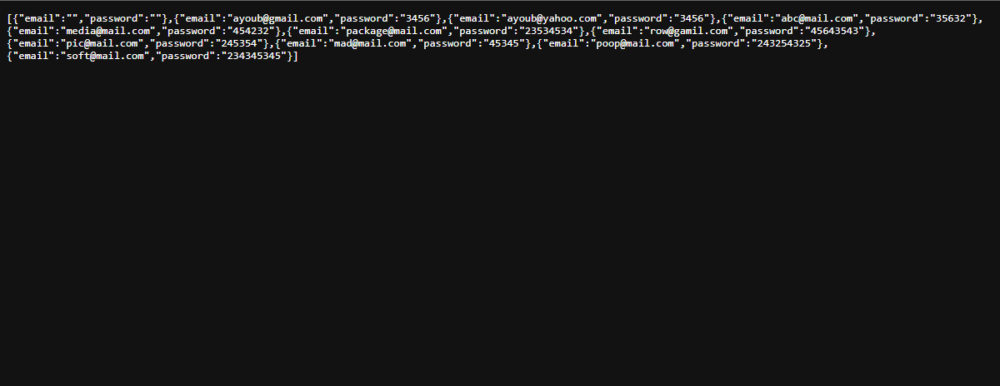

# How to create a minimal backend API service using Dart Frog with MySQL database

---

[![style: very good analysis][very_good_analysis_badge]][very_good_analysis_link]
[![License: MIT][license_badge]][license_link]
[](https://dartfrog.vgv.dev)

[license_badge]: https://img.shields.io/badge/license-MIT-blue.svg
[license_link]: https://opensource.org/licenses/MIT
[very_good_analysis_badge]: https://img.shields.io/badge/style-very_good_analysis-B22C89.svg
[very_good_analysis_link]: https://pub.dev/packages/very_good_analysis

## Frogging with MySQL

---

## Getting Started

This article will show you a simple method of connecting a Dart Frog server to a remote MySQL database. (You can follow the principles here for other types of databases as well).

The easiest way to start is by installing the dart_frog_cli. To install the CLI, open the terminal and type the following command:

```dart
dart pub global activate dart_frog_cli
```

Remember:- YOu need to add path to your system environmental variable for every global pub dependency

At this point, dart_frog should be available. You can verify by running dart_frog in your terminal.

### Creating a project

```dart
dart_frog create name_of_your_project
```

Now you have one more package to install for MySQL connection

```dart
mysql_client: ^0.0.25
```

Remember:- dart_frog dependency will already be available when you create the project using CLI

### Step - 1

First you have to create a sqlConnection to our database using mysql_client

```dart
import 'package:mysql_client/mysql_client.dart';

/// creating a database connection with MySQL
class MySQLClient {
  /// Returns a singleton
  factory MySQLClient() {
    return _inst;
  }

  MySQLClient._internal() {
    _connect();
  }

  static final MySQLClient _inst = MySQLClient._internal();

  MySQLConnection? _connection;

  // initializes a connection to database
  Future<void> _connect() async {
    _connection = await MySQLConnection.createConnection(
      // "localhost" OR 127.0.0.1
      host: '127.0.0.1',
      // Your MySQL port
      port: 8000,
      // MySQL userName
      userName: 'root',
      // MySQL Database password
      password: '123456789',
      // your database name
      databaseName: 'profiles',
      // false - if your are not using SSL - otherwise it will through an error
      secure: false,
    );
    await _connection?.connect();
  }

  // execute a given query and checks for db connection
  Future<IResultSet> execute(
    String query, {
    Map<String, dynamic>? params,
    bool iterable = false,
  }) async {
    if (_connection == null || _connection?.connected == false) {
      await _connect();
    }

    if (_connection?.connected == false) {
      throw Exception('Could not connect to the database');
    }
    return _connection!.execute(query, params, iterable);
  }
}
```

### Step - 2

You have to create a table model as inside your database based on fields

```dart
/// Model based on you table inside MySQL

// ignore_for_file: public_member_api_docs

/*

Your database model - forExample

you created a database name profiles AND it has a table
called users and users have have rows and column you create
this model based on your fields inside you table


*/

class DatabaseModel {
  const DatabaseModel({
    this.email,
    this.password,
  });

  // fromJSON
  factory DatabaseModel.fromJson(Map<String, dynamic> json) {
    return DatabaseModel(
      email: json['email'] as String,
      password: json['password'] as String,
    );
  }

  // Create an DatabaseModel given a row.assoc() map
  factory DatabaseModel.fromRowAssoc(Map<String, String?> json) {
    return DatabaseModel(
      email: json['email'],
      password: json['password'],
    );
  }

  // toJSON
  Map<String, dynamic> toJson() {
    return {
      'email': email.toString(),
      'password': password.toString(),
    };
  }

  final String? email;
  final String? password;
}
```

### Step - 3

Than you have to make a query to access the dataSource inside our table.

```dart
import 'package:frogging/database/model.dart';
import 'package:frogging/database/sql_client.dart';

/// data source form MySQL

class DataSource {
  /// initializing
  const DataSource(
    this.sqlClient,
  );

  // Fetches all table fields from users table in our database
  Future<List<DatabaseModel>> fetchFields() async {
    // sqlQuey
    const sqlQuery = 'SELECT email, password FROM users;';
    // executing our sqlQuery
    final result = await sqlClient.execute(sqlQuery);
    // a list to save our users from the table -
    // i mean whatever as many as user we get from table

    final users = <DatabaseModel>[];
    for (final row in result.rows) {
      users.add(DatabaseModel.fromRowAssoc(row.assoc()));
    }
    // simply returning the whatever the the users
    // we will get from the MySQL database
    return users;
  }

  // accessing the client
  final MySQLClient sqlClient;
}
```

### Step - 4

We need to create a Middleware for our dependency injection and the file name should start with _underscore forExample
_yourFileName.dart and also because we are running our server outside of the root folder so we need a dependency injection to start our main server

```dart
import 'package:dart_frog/dart_frog.dart';
import 'package:frogging/database/sql_client.dart';
import 'package:frogging/source/data_source.dart';

/// Middleware ar use for the dependency injection
Handler middleware(Handler handler) {
  // we will call use the handler to handle our request and than
  // we will request a logger which means for each request
  // we will inject our  dependency
  return handler.use(requestLogger()).use(injectionHandler());
}

/// it will get the connection from our sqlClient and based on that
/// it will read the  context of our data source
/// because handler will handle the  each and every request we will make
Middleware injectionHandler() {
  return (handler) {
    return handler.use(
      provider<DataSource>(
        (context) => DataSource(context.read<MySQLClient>()),
      ),
    );
  };
}
//No need to panic we are using provider
```

### Step - 5

You can create a new endpoint or use the default index.dart . I want this endpoint to return all the climbing route items from the database. We need to call fetchFields() From our dataSource

```dart
import 'package:dart_frog/dart_frog.dart';
import 'package:frogging/source/data_source.dart';

// we will create a request to read our dataSource
Future<Response> onRequest(RequestContext context) async {
  // reading the context of our dataSource
  final dataRepository = context.read<DataSource>();
  // based on that we will await and fetch the fields from our database
  final users = await dataRepository.fetchFields();
  // than we will return the response as JSON
  return Response.json(body: users);
}
```

### Step - 6

Creating a custom entryPoint - Dart Frog supports creating a custom entrypoint in cases where you need fine-grained control over the server initialization or wish to execute code prior to starting the server.
To create a custom entrypoint simply create a main.dart file at the root of the project and expose a top-level run method.

```dart
import 'dart:io';

import 'package:dart_frog/dart_frog.dart';
import 'package:frogging/database/sql_client.dart';

/// initializing our SQL Client
final mysqlClient = MySQLClient();

/*

Handler:-    handle the request
IP:-         default as 127.0.0.1 OR localhost
PORT:-       default 8080

 */

// function to run our HTTP server
Future<HttpServer> run(Handler handler, InternetAddress ip, int port) {
  return serve(handler.use(databaseHandler()), ip, port);
}

// handling the request for our database by reading it's context
Middleware databaseHandler() {
  return (handler) {
    return handler.use(
      provider<MySQLClient>(
        (context) => mysqlClient,
      ),
    );
  };
}
```

### My Database structure inside MySQL

Profiles is a database name and users is a table

email and password are fields - based on this we created our database model


### Command to run our server

run this command inside you terminal to start the server

```dart
dart_frog dev
```

It will show like this


### Response

The response that you will get in you browser


## Remember

First thing you have to remember is that you the port address that you use for MySQL should be different than the port that you use for server. The default server port is 8080. In  my case i use 8000 for MySQL and for server is 8080

### Github Repo

[Link](https://github.com/ayoubzulfiqar/frogging_with_mysql)

### Dev.to

[Article](https://dev.to/ayoubzulfiqar/how-to-create-a-minimal-backend-api-service-using-dart-frog-with-mysql-database-5hig)
